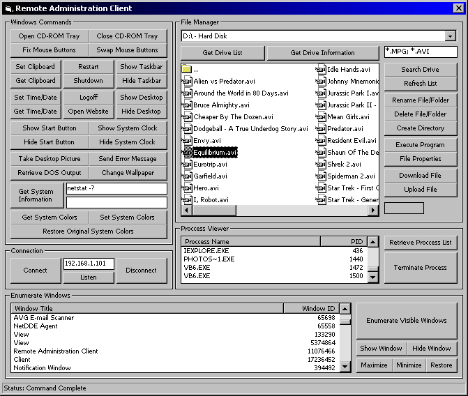

## Client\-Server \(RAT\) \(Remade\-Nemisis\)

### Description

I had posted another server client remote admin called Nemisis a while back that I had not worked on in years and I just found another version that I made which seems to be alot more perfected then the previous one and I commented almost every line of code so I hope you like it. Some may call it a trojan but I dont care I liked making it and it works so im proud.
 
### More Info
 

             |
---                |---
**Submitted On**   |2004-12-03 01:41:24
**By**             |[Dustin Brett](https://github.com/Planet-Source-Code/PSCIndex/blob/master/ByAuthor/dustin-brett.md)
**Level**          |Advanced
**User Rating**    |5.0 (75 globes from 15 users)
**Compatibility**  |VB 6\.0
**Category**       |[Internet/ HTML](https://github.com/Planet-Source-Code/PSCIndex/blob/master/ByCategory/internet-html__1-34.md)
**World**          |[Visual Basic](https://github.com/Planet-Source-Code/PSCIndex/blob/master/ByWorld/visual-basic.md)
**Archive File**   |[Client\-Ser18298512162004\.zip](https://github.com/Planet-Source-Code/dustin-brett-client-server-rat-remade-nemisis__1-57746/archive/master.zip)

